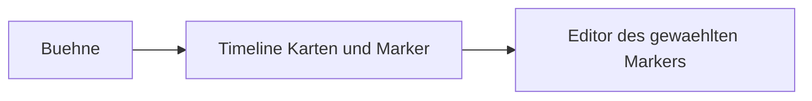

# Event-Vorschau mit Dialog-Timeline

Das bestehende Panel in [src/paperdollPanel.ts](src/paperdollPanel.ts) bleibt die Oberfläche, wird aber zur Event-Vorschau. Die Bühne (Hintergrund plus Paperdolls) bleibt oben. Darunter liegt eine horizontale Timeline, und erst wenn ein Marker gewählt ist, erscheint darunter die passende Bearbeitung. Paperdoll-Editor, Optimize und Insert bleiben dabei erhalten.

Alle Aussagen unten sind gegen das Spiel in `M:/MTS Project/Mind the School/game/scripts` geprüft; Fundstellen sind als `datei:zeile` notiert.

## Kontrollfluss: Baum, nicht Linie

Eine Timeline in reiner Quelltext-Reihenfolge liefe quer durch sich gegenseitig ausschließende Zweige (Dialog aus `if` gefolgt von Dialog aus `else`). Die Stopp-Enumeration **muss einem einzelnen Pfad folgen**. Das Modell ist deshalb ein **Baum mit aktivem Pfad**:

- `if/elif/else` und `call_custom_menu(_with_text)` sind Verzweigungen. Jede hat einen Default-Zweig (erster bzw. `True`-Zweig); Vor/Zurück folgt dem gewählten Zweig, ein Umschalter wechselt ihn.
- Der bestehende Szenenstand pro Stopp wird über `analyzePaperdoll(stopLine)` aus [src/paperdollScript.ts](src/paperdollScript.ts) gewonnen — das erbt die vorhandene if/else-Auflösung (`inactiveLines`) und die Sublabel-Region-Logik (`regionFor`), statt eine zweite Simulation zu bauen. Events sind klein genug, dass der wiederholte Aufruf pro Stopp unkritisch ist.

Custom-Menüs sind der saubere Verzweigungsfall: `MenuElement(..., EventEffect("parent.sub"))` (`school_building.rpy:214`) zeigt per String-Literal auf ein Sublabel, das direkt danach als `label .sub` folgt. Sublabels sind im Index als voller `parent.sub`-Name geführt ([src/indexer.ts](src/indexer.ts) Kommentar bei `getPatternsForLabel`), also ist die Zweig-Auflösung ein `index.getLabel("parent.sub")`. Nicht-String-Formen von `EventEffect` (`Event | EventStorage`) und `EventSelectEffect` (`effects.rpy:389,428`) sind nicht statisch auflösbar — dort wird der Marker angezeigt, aber kein Zweig aufgemacht.

## Stopps und Marker

Ein neuer Walker in `src/eventTimeline.ts` läuft das Event-Label ab, Sublabels eingeschlossen. Wiederverwendet werden die Label-Spannen aus [src/parseImageCalls.ts](src/parseImageCalls.ts), die Paperdoll-Simulation aus [src/paperdollScript.ts](src/paperdollScript.ts) und die Bildauflösung aus [src/patternResolve.ts](src/patternResolve.ts). Der Walker mergt die drei bestehenden Scans (Dialog, Image-Calls, Paperdoll-Statements) zu **einem nach Offset sortierten Stream**.

Stopps, an denen Vor/Zurück landen:

- Dialogzeilen: `speaker "text"`, auch `emiko.say "..."`, `think`, `whisper`, `shout` und `subtitles "..."` (oft ohne Leerzeichen: `subtitles"..."`, `school_building.rpy:242`). Der Portrait-Parser lässt `subtitles` heute aus (`parsePersons.ts:9`); die Timeline nimmt sie mit.
- `$ renpy.pause(...)` — das Argument kann ein Nicht-Literal sein (`renpy.pause(cum_map[...])`, `event.rpy:2368`); dann als „Pause (dynamisch)" ohne feste Dauer zeigen.
- Bare Ren'Py-`pause` / `pause 4.0` als eigenes Statement (`daily_check.rpy:305ff`, `custom_notify.rpy:207`) — andere Syntax als `$ renpy.pause()`, eigener Recognizer.
- Pausen aus Image-Calls: `Image_Series.show_image` pausiert zwischen den Steps immer und nach dem letzten Step, wenn `pause` gesetzt ist (`images.rpy:1516`). Der `pause`-Kwarg steht als `pause = True` **vor** der schließenden Klammer, ggf. gefolgt von einer `from _call_...`-Klausel (`office_building.rpy:525`); `SHOW_IMAGE_RE` (`parseImageCalls.ts:9`) muss dafür erweitert werden, da es heute an der letzten Zahl stoppt. Jeder pausierende Step ist ein eigener Stopp.
- `image.show_video(step, pause=True)` — Methodenform auf dem `image`-Objekt (`images.rpy:454`), pausiert intern nur bei `pause=True` (`show_video_label`, `images.rpy:1479`). Ohne `pause` ist es kein Stopp (dann folgt im Spiel meist ein separates `renpy.pause`, `gym.rpy:172-175`).

Marker sitzen zwischen den Stopps und sind selbst keine Stopps, außer sie enthalten eine Pause:

- `image.show` / `show_pattern` / `show_image`
- `paperdoll.display` und `paperdoll_manager.display`
- `set_background` / `set_background_split`
- `call_custom_menu` und `call_custom_menu_with_text` (`MenuElement` mit `EventEffect("label.sub")`). Die beiden Signaturen unterscheiden sich: `call_custom_menu_with_text(text, person, with_leave, *elements)` vs. `call_custom_menu(with_leave, *elements)` — beim zweiten ist das erste Positional ein `bool`, kein Text (`menu.rpy:238,281`). Die `person` kann dynamisch sein (`get_kwargs('character', ...)`, `event.rpy:2420`).
- ein Plus zwischen den Blöcken

Ein Custom-Menu, das auf Sublabels zeigt, spaltet die Leiste: die Wahl im Editor darunter setzt den weiteren Verlauf auf dieses Sublabel. Der Stand davor (Bild, Paperdolls) bleibt der des Elternlabels, wie die bisherige Simulation.

## Charakterportraits auf den Dialogkarten

Jede Dialogkarte zeigt neben Sprechername und Text die **registrierten Portraits** des/der Sprecher. Die Sprecher-Auflösung kommt aus demselben geteilten Say-Scanner wie oben (`shared-dialog-scan`); pro Dialog-Stopp liefert er die `personKeys` (eine Zeile kann mehrere ergeben, z.B. Gruppensprecher — genau wie [src/portraitDecorations.ts](src/portraitDecorations.ts) sie heute per `parseDialoguePortraitSites` bündelt).

Die Portrait-Datei je `personKey` kommt aus derselben Quelle wie die Editor-Dekorationen: den mitgelieferten Portraits unter `assets/` **plus** den benutzerdefinierten aus dem `PortraitStore`. Diese Zuordnung steckt heute privat im `PortraitDecorator` (`portraitDecorations.ts:53-72`); sie wird in einen kleinen geteilten Resolver (`resolvePortraitFile(personKey)` bzw. eine Methode am `PortraitStore`) faktoriert, den Decorator und Timeline gemeinsam nutzen.

Unterschied zur Editor-Dekoration: Im Webview gibt es volles CSS, also werden die Portraits direkt als `` per `asWebviewUri` gerendert — der `sharp`-Strip aus `buildStrip` (nur nötig, weil VS Codes `contentIconPath` keine Skalierung kann) entfällt. Damit die Bilder laden, müssen die Portrait-Ordner (`assets/` und die `PortraitStore`-Pfade) in die `localResourceRoots` des Panels aufgenommen werden (heute nur `getImageRoots()`, `paperdollPanel.ts:134-138`).

Fallback: Hat ein `personKey` kein Portrait (häufig bei Mod-Charakteren, siehe unten), zeigt die Karte Name bzw. Initiale statt eines Bildes — nie ein leeres oder falsches Portrait. Der Nutzer kann über den bestehenden „Custom Portrait"-Weg (`PortraitStore`) ein Portrait für Mod-Charaktere nachrüsten.

## Mod-Kompatibilität

Das System muss für Mods genauso funktionieren wie für Basisinhalte. Laut Wiki ([Modding.md](file:///M:/MTS%20Project/Mind%20the%20School/wiki/Modding.md)) liegen Mods als `.rpy` unter `game/mods/<Mod>/` mit eigenem `images/`; `set_current_mod(key)` lenkt `Pattern("main", "images/…")` in den Mod-Ordner um (plain `images/…`, nie `mods/<Mod>/…`). Die Extension ist darauf bereits eingerichtet, und die Timeline erbt das, **solange sie ausschließlich über die vorhandenen Schichten geht**:

- **Indexierung:** Der Indexer scannt `**/*.rpy` (`indexer.ts:182`), also auch `game/mods/**`. Mod-Labels, -Events, -`load_person` und -`Pattern`s sind damit im Index — Menü-Zweige (`EventEffect("mod_label.sub")`) über `index.getLabel(...)` und Personen/Paperdoll-Defaults inklusive.
- **Bildauflösung:** `getImageRoots` fügt jeden `game/mods/<Mod>/` als eigenen Root hinzu (`addModImageRoots`, `patternResolve.ts:76`, mit direktem Wiki-Verweis), und ein standalone geöffneter Mod-Ordner wird ebenfalls als Root erkannt. Die Timeline nutzt für Bilder und Hintergründe nur `resolveImagesForCall` / `getImageRoots` — **keine hartkodierten `game/`-Pfade** —, dann lösen Mod-Bilder identisch auf.
- **Personen & Portraits:** Mod-`load_person`-Charaktere haben typischerweise **kein** mitgeliefertes Portrait in `assets/`. Die Dialogkarte degradiert dann sauber (Name/Initiale), und der `PortraitStore` ist der Weg, Portraits für Mod-Charaktere zu ergänzen. Der geteilte Portrait-Resolver (siehe oben) deckt beide Quellen ab.
- **`localResourceRoots`:** müssen alle Bild-Roots (inkl. Mod-Ordner) und Portrait-Ordner umfassen, sonst laden Mod-Bilder im Webview nicht.

Keine dieser Punkte verlangt Sonderfälle für Mods — sie sind eine Konsequenz daraus, dass die Vorschau strikt über Index und die mod-bewussten Auflösungs-Helfer läuft. Der `mod-compat`-Todo verifiziert das an einem echten Mod (z.B. dem gebundelten `game/mods/CheatMod`).

## Rohe scene/show-Statements (Legacy-Fallback)

In einem sauber definierten Event sind rohe `scene`/`show`-Aufrufe **Legacy** — Bild und Hintergrund laufen über die Image-Call- und Paperdoll-API. Es gibt aber Altbestände (z.B. Animations-/Epilog-Sequenzen), die nativ arbeiten:

```
scene anim_first_week_epilogue_17 with dissolveM
pause
```
(`daily_check.rpy:304-326`). Weder die Paperdoll-Simulation noch `parseImageCalls` erfassen das.

Das ist kein Kernfall, wird aber nicht ignoriert: Der Walker erkennt rohe `scene <image> with …` / `show <image>` und setzt an dieser Stelle einen neutralen Marker, der die Bühne als „nicht simuliert (Legacy `scene`)" kennzeichnet, statt einen falschen Paperdoll-Stand weiterzuzeigen. Der bare `pause` dahinter bleibt ein normaler Stopp. Eine echte Bild-Auflösung roher `scene`-Ziele ist ausdrücklich kein Ziel dieses Plans.

## Oberfläche

Die Elemente:

- Bühne zeigt den aufgelaufenen Bild- und Paperdoll-Stand bis zum aktuellen Stopp, plus den Dialogtext auf der aktuellen Karte. In Legacy-`scene`-Blöcken zeigt sie den Hinweis „nicht simuliert".
- Timeline: Karten für vorherigen, aktuellen und nächsten Stopp nebeneinander, weitere per Scroll. Aktuelle Karte ist hervorgehoben. Klick auf eine Karte springt dorthin. Dialogkarten zeigen die registrierten Sprecher-Portraits (siehe unten); Karten dürfen Regie-Kommentare hinter `image.show(N) # …` (`school_building.rpy:207`) als Beschriftung nutzen.
- Buttons: zum Anfang, ein Stopp zurück, ein Stopp vor, zum Ende.
- Marker zwischen den Karten. Klick öffnet darunter die Bearbeitung und lässt den Rest der Leiste stehen.
- Paperdoll-Marker öffnen die jetzige Call-GUI (Body, Head, Framing, Update, Insert, Optimize).
- Bild-Marker öffnen die aufgelöste Vorschau und den Call-Text.
- Menü-Marker öffnen die Auswahl; ein Eintrag schaltet den Zweig (nur String-`EventEffect`-Ziele sind schaltbar).
- Plus fügt an dieser Stelle eine Zeile ein und öffnet danach deren Editor: Dialog (`subtitles ""` oder der letzte Sprecher), Paperdoll-Display, `image.show`, oder ein `call_custom_menu_with_text` mit einem `MenuElement`.

### Responsives Layout

Das Panel muss in drei sehr unterschiedlichen Formaten sauber aussehen: eigenes Fenster auf einem **Hochkant-Monitor** (schmal + hoch), in einer **Split-Group** (schmal + niedrig) und über die **ganze Fensterbreite** (breit + niedrig). Das Layout richtet sich deshalb nach dem Seitenverhältnis, nicht nach fixen Breakpoints. Umgesetzt mit CSS **Container Queries** (wie schon im bestehenden Panel, `paperdollPanel.ts:872-890`) statt `@media`, damit es auch in einer Split-Group misst, was tatsächlich verfügbar ist. Drei Grundmodi:

- **Breit (Querformat, ganze Breite):** Zwei Spalten. Links Bühne + Timeline, rechts der Marker-Editor. Die Bühne behält ihr 16:9 und wird so groß wie die linke Spalte zulässt; der Editor scrollt bei Bedarf in seiner eigenen Spalte. Die Timeline-Karten laufen horizontal unter der Bühne.
- **Schmal-hoch (Hochkant):** Eine Spalte, vertikal gestapelt: Bühne oben, darunter die (horizontal scrollende) Timeline, darunter der Editor. Die Bühne darf nicht die halbe Höhe fressen — sie bekommt eine `max-height` in `cqh`, damit Timeline und Editor auf dem hohen Monitor Raum behalten.
- **Schmal-niedrig (Split-Group):** Wie schmal-hoch, aber Bühne kleiner und Timeline auf eine kompakte Karten-Reihe reduziert; der Editor bekommt Priorität, weil hier am wenigsten Platz ist.

Robustheitsregeln:

- Die drei Zonen (Bühne, Timeline, Editor) sind ein Flex-/Grid-Container mit `min-height: 0` / `min-width: 0`, damit nichts überläuft; jede Zone scrollt intern statt die Seite zu sprengen. Die Timeline hat immer horizontales `overflow`, der Editor vertikales.
- Die Schritt-Buttons und der aktive Karten-Fokus bleiben immer sichtbar (sticky), egal wie klein das Panel wird — Navigation darf nie weggescrollt werden.
- Die Bühne skaliert über `container-type: size` und `aspect-ratio`, nie über feste Pixel; auf sehr schmalen Breiten fällt der Marker-Editor unter die Timeline statt neben sie (kein horizontales Body-Scrolling).
- Ganz kleine Fläche (z.B. schmale Split-Group): Timeline auf ±1 Karte um den aktuellen Stopp reduzieren, Rest per Scroll; Editor-Felder von zwei Spalten auf eine umbrechen. Die bestehenden `@container`-Stufen des Call-Editors werden dafür wiederverwendet.

Stopps werden einmal serverseitig berechnet und als kompaktes Modell an den Webview geschickt; Navigation läuft clientseitig, nur das Öffnen eines Marker-Editors triggert Server-Roundtrips. Nach einer Bearbeitung (Plus-Insert, Marker-Apply) wird die Timeline neu berechnet und der aktuelle logische Stopp erhalten, analog zum bestehenden `session.line`-Shift-Tracking nach Optimize/Insert.

Der CodeLens **Paperdoll** am Event-Label öffnet diese Vorschau am nächsten Stopp zu der Zeile; ein Lens auf einem konkreten `display`-Call springt direkt in dessen Marker-Editor. Panel-ID und Titel (heute `mtsPaperdoll` / „MTS Paperdoll", `paperdollPanel.ts:135`) sowie der Lens-Text werden auf die Vorschau umbenannt.

## Umsetzung in Phasen

1. **timeline-recognizers + shared-dialog-scan + timeline-model**: reine Logik in `eventTimeline.ts`, mit Fixture-Tests je Recognizer und für Reihenfolge/Pfadwahl/Menü-Branching — vor jedem UI-Wiring.
2. **preview-shell**: read-only Timeline + Bühne + Navigation.
3. **marker-editors**: Paperdoll-GUI, Bildvorschau, Menü-Zweigwahl an die Marker hängen.
4. **plus-insert**: Einfügen als letztes, da es dieselbe fragile Offset-/Indent-Logik wie `insertAtCursor` berührt.

`eventTimeline.ts` ist reine Logik und bekommt Fixture-Tests analog zu [scripts/verify.ts](scripts/verify.ts), bevor die Webview angebunden wird.


